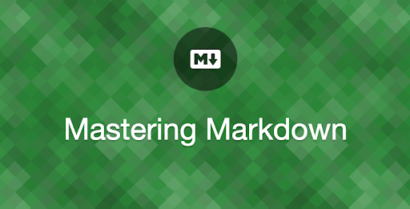

# GitHub 

**Did You Hear Before About GitHub or Github Pages ? Did you see ReadMe files in somewhere in the internet when your searching for something related to Source Code ?**


## Let's Start

Let's Start

> Github Pages

```
Github Pages is a technology or we can say it's a tool provided by Github community to help the developer to make their 
code a life, as we know if you wanna test your code and host it or publish web pages to the internet  we need a hosting service which
it will cost some fees and it's not fair to pay every time when I want to view how my webpage looks like or when I want to share it with me, classmates.
here Github Pages coming with a great solution for those people with providing a tool to make their repository a life with URL.
```
 

**For More Info About GitHub Pages Plz Folowing the Link :** [GitHub Pages](https://pages.github.com/)

> MarkDown

```
Have you ever bought an electronic device and you didn't see the guideline book ?

everything you bought or you will buy must have a guideline that tells you how to use this device. 

it's the same in developers worlds *_* , every source code or project publish to the internet has a readme file
that includes the project explain and some instruction in how to use and install this code.

  it looks like a notepad file with but the difference is that we can make a readme file more structured and add 
  some markup to it acutely makeup (Girls Its a Joke ^-^)  .

with MarkDown we can
- mad a change to a text like make it **Bold**
- Adding a list item and links . 
- Add images
- making some headers. 
```


**For More Info About GitHub Pages Plz Folowing the Link :** [MarkDown](https://docs.github.com/en/github/writing-on-github/basic-writing-and-formatting-syntax)

## Contact Info : 
**Please Feel Free To Contact Me When You Need help ^_^**
* [www.facebook.com/aghyadalbalkhi](www.facebook.com/aghyadalbalkhi)
* Email : aghyadalbalkhi@gmail.com
