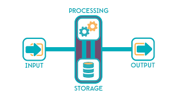
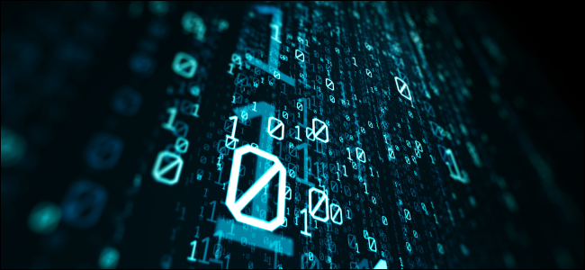

# Read: 06b - Computer Architecture and Logic

**Have you ever asked yourself how Computer works ؟ we use computer every day but we dont know how it work , so we will togather learn more about it**

## we will cover these Topics : 

* What Makes A Computer 
* How Info Prepresent info insid the computer
* Diffrenet Components of  computer

## Let's Start

> What Makes A Computer
To make a computer, we need the basic elements

- Elements For Input Like `Kyeboard`
- Elements For Storge Like `Hrad Drive`
- Elements For Proccesing `CPU`
- Elements For Output `Screen`

 

**For More Info** [What Makes A Computer](https://www.youtube.com/watch?v=mCq8-xTH7jA&list=PLzdnOPI1iJNcsRwJhvksEo1tJqjIqWbN-&index=3&t=0s)

> How Info Prepresent info insid the computer
  Data Prepresent as zero and one only 

- Zero Like `True`
- One Like `False`

 

**For More Info** [How Info Prepresent info insid the computerWhat Makes A Computer](https://www.youtube.com/watch?v=USCBCmwMCDA&list=PLzdnOPI1iJNcsRwJhvksEo1tJqjIqWbN-&index=3)

> Diffrenet Components of Computer
  Data Prepresent as zero and one only 

- Memory 
- Hard 
- CPU

 

**For More Info** [Diffrenet Components of Computer](https://www.youtube.com/watch?v=DKGZlaPlVLY&list=PLzdnOPI1iJNcsRwJhvksEo1tJqjIqWbN-&index=5)
