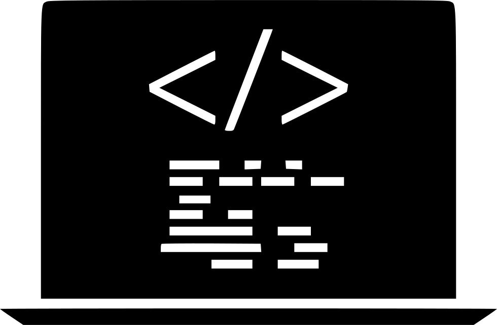

# Read: 07 - Programming with JavaScript


**Today we will talk about JavaScript and what it Does For Our Broswer**
```
Topics That Will be Cover : 
- How JavaScript Make Our Page Interactive
- Operations
- Funcation 

```

Let's Start

> How JavaScript Make Our Page Interactive

*JS Can access Our Page Content and modify these Pages and because of javascript is a programming language it can use programming rules to broswer to follow with .* 
*and it can deal with event so we can determin when script should work .*

### So what is  a script ? 

Script is series of instruction that computer can follow to atchive a goal .

Les's Start To Know to Write a Script .

* Set your Goals and list the tasks
* Design the Script
* Design a script steps 

### Example Of Script 
```
<!DOCTYPE html>
<html>
<body>

<h2>JavaScript Numbers</h2>

<p>Number can be written with or without decimals.</p>

<p id="demo"></p>

<script>
document.getElementById("demo").innerHTML = 10.50;
</script>

</body>
</html>

```

 

**For More Info About GitHub Pages Plz Folowing the Link :** [W3School](https://www.w3schools.com/js/)


> Operations

*An operator in a programming language is a symbol that tells the compiler or interpreter to perform specific mathematical*

## Example 

| + | Add One Value To anOther |
|---|--------------------------|
| - | Sub value from another   |
| / | divides two values       |


> Function 

*It's a group of series of statements togather to do a specifics taks*

**Function  Elements**
- function  Name
- Parameter
- Header
- Code insid Function  

**Les's Have a Example**

```
function myFunction(p1, p2) {
  return p1 * p2;
}
document.getElementById("demo").innerHTML = myFunction(4, 3);
```

 


## Contact Info : 
**Please Feel Free To Contact Me When You Need help ^_^**
* [www.facebook.com/aghyadalbalkhi](www.facebook.com/aghyadalbalkhi)
* Email : aghyadalbalkhi@gmail.com

