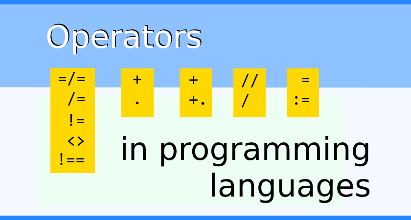
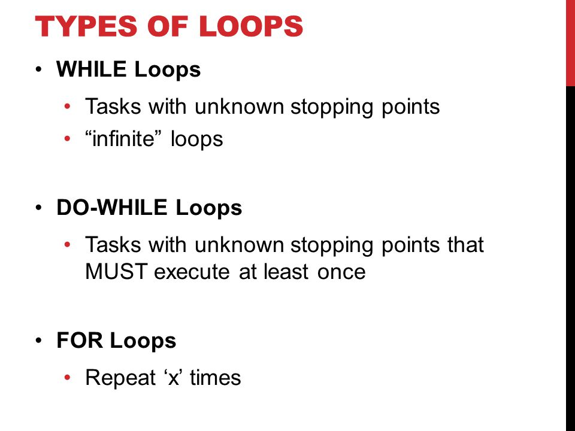
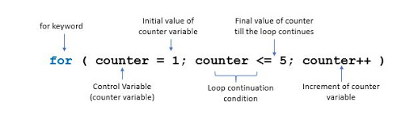

# Read: 08 - Operators and Loops

**Previously we talked about Operators and kinds of it and we also talked about fucntion and how to declaration a one**
*Now we we talked about* `loops` and `Operators` .

## Let's Start

> Operators

*EVALUATING CONDITION

*We used to evaluate two value or condition and the result will be* `True` or `False` .

| ==  | Is Equal To          |
|-----|----------------------|
| !=  | Is Not Equal To      |
| === | Strict Equal To      |
| !== | Strict Not Equal To  |

* locial Operators 

*we use to compaire the result of more the one comparison operator* 

| &&  | Logical AND          |
|-----|----------------------|
| ||  | Logical OR           |
| ! | Logical Not            |

 

> Loops

*Loop it check the condition* `samilier to If Condition` *and if it true it will be run the code* `samilir to function`

**Loops Types**
- For 
- While
- Do While

**and you can see the Differnce in the image**

 

> Loop Component 

- For Keyword 
- Condition
- Curly Bracket 

 

**Loop Example**
```
var text = "";
var i;
for (i = 0; i < 5; i++) {
  text += "The number is " + i + "<br>";
}
document.getElementById("demo").innerHTML = text;

```

## Contact Info : 
**Please Feel Free To Contact Me When You Need help ^_^**
* [www.facebook.com/aghyadalbalkhi](www.facebook.com/aghyadalbalkhi)
* Email : aghyadalbalkhi@gmail.com
