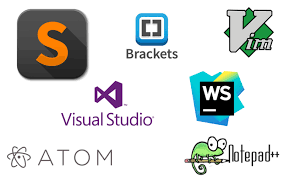
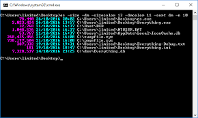
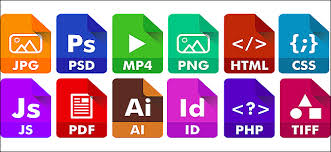

# Read: 02 - The Coder's Computer


**Today we will talk about what the tools and software that programmer used in the Technology industry**
```
To Develop any web site the programmer should have the following : 
- text editors
- skills in  using the command line
- general info about files 

```

Let's Start

> Text editors

```
A text editor is a program that used to edit text files. 
The text editor is working on several platforms like Windows, Linux. 
we can use a text editor to write web pages like HTML or PHP pages or asp pages, acutely we can use it in anything and save it as extensions of what we  want to develop 
```
### we have several text editor like :
* NotPad ++
* ATOM
* Brackets

 

**For More Info About GitHub Pages Plz Folowing the Link :** [wikipedia](https://ar.wikipedia.org/wiki/%D9%85%D8%AD%D8%B1%D8%B1_%D9%86%D8%B5%D9%88%D8%B5)

> skills in  using the command line

```
Command Line it's the UserInterface that help user to typing commands at prompts, instead of using a mouse or exploer folder , for example we can create a folder by using command line 
or we can run programm also by coomand line 

For Example we can : 
- To Create a folder we need to use mkdir folow with the name of folder
- to exploer files we use dir command  
- we use cd to go to specific path  
```
**Exmaple :**

Making Bold Text : we can use ** in the begin of the text and at the end  `**Bold**` **Bold**
To create a heading, : we use hash `#` at the begin of sentence like `# The largest heading` and it will be lookslike below 
# Here The Second Example Of Heading 

 

**For More Info About Command Line Plz Folowing the Link :** [wikipedia](https://ar.wikipedia.org/wiki/%D9%88%D8%A7%D8%AC%D9%87%D8%A9_%D8%B3%D8%B7%D8%B1_%D8%A7%D9%84%D8%A3%D9%88%D8%A7%D9%85%D8%B1)

>General info about files

```
Everything in the operating system is files, but what distinguishes the files from each other is extension where each files has own extension 
```
### we have several extension like :
* .txt
* .psd
* .docx

 

**For More Info About Files Plz Folowing the Link :** [wikipedia](https://ar.wikipedia.org/wiki/%D8%A7%D9%85%D8%AA%D8%AF%D8%A7%D8%AF_%D9%85%D9%84%D9%81)


## Contact Info : 
**Please Feel Free To Contact Me When You Need help ^_^**
* [www.facebook.com/aghyadalbalkhi](www.facebook.com/aghyadalbalkhi)
* Email : aghyadalbalkhi@gmail.com
