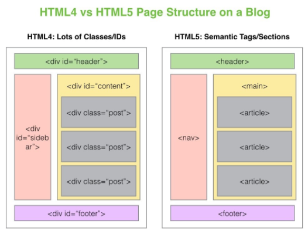

# Read: 01 - Introductory HTML and JavaScript

**Topice That Will Be Cover In This artical**

* Introduction
* HTML Structure
* HTML Extra Markup 
* HTML HTML5 Layout 
* HTML Process & Design 

## Let's Start

> Introduction To Internet 

 
```
The internet or the Net is the world’s largest computer network
which connects millions of computer all over the world
and our web page (HTML) located in one of this computer called server in somewhere in the world .
```
**the question is how to know the server that contains the page that I requested ?**
```
it's the DNS Job

The DNS is like the phone book where you can find the number by searching with the name 
and DNS Work in the same way where we can find the page location through DNS Table and after 
that the page rendering in our broswers  
```

**For More Info About DNS  Plz Folowing the Link :** [wikipedia](https://en.wikipedia.org/wiki/Domain_Name_System)


> HTML Structure
 ```
 HTML Uses Elements Called Tags to Annotate Documents and Describe the Structure of Pages such as "heading", "paragraph", "table", and so on ...
 Browsers do NOT display the HTML tags, but use them to render the content of the page
 ```
 

**Some Example Of Tags**

* The <!DOCTYPE html> declaration defines this document to be HTML5
* The <html> element is the root element of an HTML page
* The 'head' element, which contains the information about the document
* The 'body' element, which contains the real content of the document we see.

**Type of HTML Tags**

Html tags are categorized as Pair Tags and Non Pairs Tags on the basics of

- Pair Tags are tags with both opening and closing. 
They can have child tags and text. For exp `<p>` `<h1>` `<body>` 

- Non pair tags are tags with opening only `` `<input>`

> HTML Extra Markup

**Block & Inline Tags**

* Block Tags
```
Block elements are the elements that always start with a new line, 
take up all available width of the website and are displayed in a column

```

* Inline Tags
```
HTML inline elements don't start with a new line. 
They also only take up as much space as their content

```
 

**Multimedia**
- Video 
```
The HTML5 <video> element specifies a standard way to embed a video in a web page.
```
**For Example**
` <video src="SDGs.mp4" width="320" height="240" controls>  Text only be displayed in browsers that do not support the video element    </video>`

> HTML HTML5 Layout

**What is Semantic HTML**

```
Semantic HTML or semantic markup is HTML that introduces meaning to the web page rather
than just presentation For example, a <p> tag indicates that the enclosed text is a paragraph
```
 
